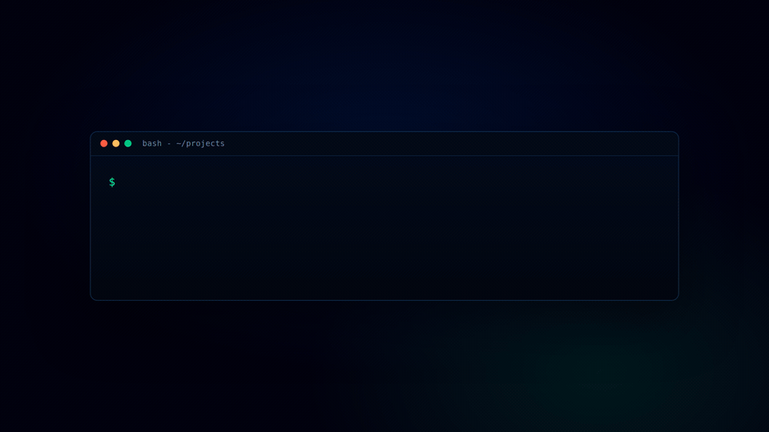

<p align="center">
  
</p>

<h1 align="center">GIT_REAL</h1>

<p align="center">
  <strong>Get real about your repo.</strong> Stop fighting agents over dirty trees.
</p>

<p align="center">
  Drop-in git situational awareness, for humans <strong>and</strong> AI agents.<br>
  <sub>one file &middot; zero required dependencies &middot; <code>python gitreal.py</code> &middot; Linux / macOS / Windows / WSL2</sub>
</p>

<p align="center">
  <a href="https://github.com/DanManREAL-DEVELOPER/dmr_git_real/actions/workflows/ci.yml"></a>
  
  
  
</p>

---

## Get protected in three steps

**1. Download or clone this repository.**

```bash
git clone https://github.com/DanManREAL-DEVELOPER/dmr_git_real.git
cd dmr_git_real
```

**2. Point the installer at the project you want protected** (any Git repo on your machine):

```bash
python setup_gitreal.py "/absolute/path/to/your/project" --with-hook
```

**3. Look for the receipt.** Setup succeeded only if the last line is exactly:

```text
GIT_REAL_SETUP_PASS
```

That's it. Your project now has the live verdict file, the dashboard, the agent contract wired into your agent instruction files, and a pre-commit guard.

Prefer a hand-held walkthrough? Open [`SETUP_GUIDE.html`](./SETUP_GUIDE.html) in a browser. Running a small or low-context agent? Hand it [`AGENT_SETUP.md`](./AGENT_SETUP.md) — a deterministic runbook with exact pass/fail receipts.

## The problem

You run multiple AI coding agents (Claude Code, Codex, Cursor) across 8 to 12 worktrees. They leave dirty trees, untracked files, and stray side branches everywhere. Then an agent stops and asks:

> "There's a dirty working tree here, what do you want to do with it?"

...and you have no idea what it means, whether it is junk, or whether it is an hour of unsaved work you are about to nuke.

GIT_REAL answers that. Visually for you, and in machine-readable JSON for the agents themselves.

## The fix: your agents read the verdict, not you

Every run writes a machine-readable verdict to **`.git-real/git-real.json`**, refreshed on every change. Point your agents' own instruction files at it, and the "dirty tree?" question gets answered by the agent **before** it commits or discards - so it never lands on you.

Drop this into your repo's `CLAUDE.md`, `AGENTS.md`, `.cursorrules`, or any agent's system instructions:

> **Before any `git commit`, `git checkout .`, `git clean -fd`, or `git reset --hard`:**
>
> **Step 1 - refresh:** run `python gitreal.py . --once` (or call the MCP tool, which is always live; skip the refresh if GIT_REAL is already running and watching this repo). The file stamps `generated_at` so you can tell if it is stale.
>
> **Step 2 - read `.git-real/git-real.json` and act:**
> - `scores.safe_commit_band` not `"GO"` (or `scores.safe_commit` < 80): **do not commit** - surface `scores.safe_commit_reasons` and fix them first.
> - `scores.safe_delete_band` not `"GO"`: **do not discard the tree** - there is unsaved work in `scores.safe_delete_reasons`.
> - `secrets[]` non-empty: **stop and warn the user** - a secret is about to be committed.

Or let GIT_REAL install it for you: `python gitreal.py --wire-agents` injects this block into your `CLAUDE.md` / `AGENTS.md` / `.cursorrules` as an idempotent managed block (re-running replaces it, never duplicates; it creates `AGENTS.md` if none of them exist).

That's the whole trick - and it's what no other git tool does. Everything else renders your repo's state for a *human* to read. GIT_REAL writes a *verdict an agent acts on*, turning "there's a dirty tree here, what do you want to do?" into a call the agent already made. Want it live mid-task instead of from a file? The [MCP server](#agent-integration-mcp) exposes the same verdict as callable tools.

## The GIT_REAL CLOSEOUT

Ending a session is where work gets lost and secrets get committed. So this distribution ships [`SKILL.md`](./SKILL.md): an agent skill that turns the phrase **"do a GIT_REAL CLOSEOUT"** into a fixed ritual — refresh the verdict, hard-stop on secrets, commit only under a `GO` band, push, leave no stashes or stray branches, and end with an exact receipt:

```text
GIT_REAL_CLOSEOUT_PASS
```

Drop `SKILL.md` into your agent's skills directory (for Claude Code: `.claude/skills/git-real-closeout/SKILL.md`), or paste its steps into any agent's instructions. If any gate fails, the agent must answer `GIT_REAL_CLOSEOUT_BLOCKED` plus the one blocking reason — never a polite fake pass.

## Three ways to run it

**Single repo.** Drop `gitreal.py` in and run:
```bash
python gitreal.py
# dashboard: http://127.0.0.1:8787   writes .git-real/git-real.{html,json}
```

**FLEET, the multi-repo command center** (the one for your 8 to 12 worktrees):
```bash
python gitreal.py ~/projects --all
# scans every git repo under the folder and puts them on ONE wall
```

The FLEET wall shows every repo as a card with its safe-commit and safe-discard scores, dirty count, side-branch count, and push state, sorted most-dangerous-first, with any repo containing secrets flashing red. Click a card for the full breakdown.

**MCP, so your agents can call it** (see [Agent integration](#agent-integration-mcp) below).

## What it tracks

- **Every dirty, staged, and untracked file**, classified the moment it appears: `DIRTY`, `STAGED`, `NEW` (precious, never committed), `JUNK` (build artifact), `CONFLICT`.
- **Push state**: branch, upstream, ahead/behind, and every unpushed commit.
- **Main and side branches**: flags side branches that are unmerged or unpushed so stranded agent work stops vanishing.
- **Secrets**: content and filename detection (`.env`, `*.pem`, AWS / OpenAI / Anthropic / Stripe / GitHub keys, JWTs, DB URLs, snake_case `db_password` style keys, and more) with a blinking red alert. Matches are masked so the JSON never leaks the secret.
- **Secret-in-history** (with `--history`): walks the **full commit graph** and flags secrets that were ALREADY COMMITTED (an incident, rotate and scrub) versus only in the working tree (caught in time) — including secrets that were committed and later deleted.
- **Ignored files**: a clean collapsed list (`node_modules/` as one row, not 10,000).
- **.gitignore suggestions**: junk found outside `.gitignore` is surfaced so you can add it (via the CLI or the GIT_REAL MCP — the dashboard is read-only).

Got fixtures or sample files with deliberately-fake secrets? Drop a `# git-real:allow` comment on the line, or list path globs in a `.gitrealallow` file at the repo root (one per line; a bare `tests/` covers everything beneath it) to keep them from red-alerting.

## The two scores

GIT_REAL turns "what do I do with this tree?" into two numbers, recomputed every refresh, each with its reasons spelled out:

- **Safe to Commit %**: how clean a commit would be right now. Secrets or an un-ignored `.env` crash it toward 0 (`DO NOT COMMIT`). Junk, huge files, or a 200-file accidental `git add -A` knock it down.
- **Safe to Discard %**: how safe it is to nuke the dirty tree (`git checkout .` / `git clean -fd`). New untracked source you would lose forever crashes it toward 0 (`DO NOT DISCARD, UNSAVED WORK`). Only build artifacts dirty keeps it high.

A clean tree is `100 / 100`. A tree with a secret plus new uncommitted code is `0 / 0`, reasons listed.

## Agent integration (MCP)

The [agent hook](#the-fix-your-agents-read-the-verdict-not-you) above works straight from the JSON file - no server needed. For agents that prefer to **call** the check live mid-task ("checking GIT_REAL before I touch this tree"), GIT_REAL also ships an MCP server for Claude Code, Codex, or any MCP client - the same verdict, exposed as tools.

Tools exposed: `is_safe_to_commit`, `is_safe_to_discard`, `list_secrets`, `secrets_in_history`, `git_real_status`, `git_real_fleet`, `gitignore_add`.

`git_real_status` returns each side branch with its last commit subject and your unpushed commits, so an agent can tell you WHAT a branch you forgot actually was, instead of disappearing into `git log` for twenty minutes.

```bash
python -m pip install -r requirements-mcp.txt   # the MCP SDK (only needed for the MCP server, not the dashboard)
```

**Claude Code** (run from where `gitreal_mcp.py` lives, use the absolute path):
```bash
claude mcp add --transport stdio git-real -- python /abs/path/to/gitreal_mcp.py
```
or edit `~/.claude.json` (or a project `.mcp.json`):
```json
{ "mcpServers": { "git-real": { "type": "stdio", "command": "python", "args": ["/abs/path/to/gitreal_mcp.py"] } } }
```

**Codex** (`codex mcp add git-real -- python /abs/path/to/gitreal_mcp.py`), or edit `~/.codex/config.toml`:
```toml
[mcp_servers.git-real]
command = "python"
args = ["/abs/path/to/gitreal_mcp.py"]
```

Verify with `claude mcp list` or `/mcp` inside either tool. `gitreal_mcp.py` imports the `gitreal.py` next to it, so it always reflects your current rules.

**No MCP?** You don't need it - that's the [agent hook above](#the-fix-your-agents-read-the-verdict-not-you): point `CLAUDE.md` / `AGENTS.md` at `.git-real/git-real.json` and your agents read the verdict straight from the file. MCP is the live, callable version of the same verdict.

## Guardrail mode (pre-commit / CI)

Use `--once` with exit codes to block bad commits:

```bash
python gitreal.py . --once --fail-on-secret --fail-under 80
#   exit 2  a secret was detected
#   exit 1  safe-commit score is below 80
#   exit 0  clean
```

**Wire it as a git hook** so a bad commit is actually *blocked*, not just reported. The installer's `--with-hook` flag does this for you; to do it by hand, point the hook at wherever `gitreal.py` lives:

```bash
# .git/hooks/pre-commit  (chmod +x it)
#!/bin/sh
python /abs/path/to/gitreal.py . --once --fail-on-secret --fail-under 80 || {
  echo "GIT_REAL blocked this commit - read .git-real/git-real.json"; exit 1;
}
```

```bash
# .git/hooks/pre-push  (chmod +x it) - heavier: also audits already-committed history
#!/bin/sh
python /abs/path/to/gitreal.py . --once --fail-on-secret --history || {
  echo "GIT_REAL blocked this push - a secret is in your working tree or history"; exit 1;
}
```

(Prefer a hook manager? Drop the same `--once` command into a [`pre-commit`](https://pre-commit.com/) `local` hook.)

Across every repo at once:
```bash
python gitreal.py ~/projects --all --once --fail-on-secret   # CI guard for your whole workspace

# audit for already-committed secrets (incidents) in history:
python gitreal.py . --once --history
```

## Project layout - single file, on purpose

`gitreal.py` is the whole tool: the watcher, the scoring, the secret + secret-in-history
scanner, and the dashboard HTML all live in that one file. No build step, no framework,
no `src/` maze - drop it in and run. `gitreal_mcp.py` (the MCP server), `setup_gitreal.py`
(the installer), and `tests/` sit beside it; brand assets live in `assets/`.

*Contributors: please keep it flat.* The single-file design is the feature, not an
oversight - it's what makes GIT_REAL a true drop-in. See [`CONTRIBUTING.md`](./CONTRIBUTING.md).

## Install

No build step, no package required for the dashboard (pure Python standard library). Optional `watchdog` gives instant file-event updates instead of polling:

```bash
pip install watchdog   # optional, GIT_REAL falls back to polling without it
```

### CLI

```
python gitreal.py [PATH] [options]

  PATH               folder to watch (default: current dir)
  --all / --fleet    FLEET mode: scan PATH for ALL repos (the multi-repo wall)
  --port N           dashboard port (default: 8787)
  --once             generate output once and exit (CI / pre-commit)
  --fail-under N     guardrail: exit 1 if safe-commit < N
  --fail-on-secret   guardrail: exit 2 if any secret is detected
  --history          also scan git history: flag secrets ALREADY COMMITTED (incidents)
  --poll             force polling watcher (use on /mnt/c or network drives)
  --no-server        write files only, no dashboard server
  --interval S       rescan/poll interval seconds (default: 4)
  --init             git init if PATH is not a repo yet
  --wire-agents      install the agent hook into CLAUDE.md / AGENTS.md / .cursorrules
```

> **WSL2 note:** on Windows drives (`/mnt/c/...`) inotify is unreliable, so GIT_REAL auto-switches to polling. Native paths (`~/...`) use real file events.
>
> **Pin your worktrees:** drop a `.git-real/fleet.json` like `{"repos": ["~/proj/a", "~/proj/b"]}` to always include specific repos in FLEET mode.

## JSON shape (for agents and tooling)

```jsonc
{
  "scores": {
    "safe_commit": 0, "safe_commit_label": "DO NOT COMMIT",
    "safe_commit_reasons": ["3 secret(s) detected in changed files, DO NOT COMMIT."],
    "safe_delete": 0, "safe_delete_label": "DO NOT DISCARD, UNSAVED WORK",
    "safe_delete_reasons": ["2 new untracked file(s) would be PERMANENTLY lost (never committed)."]
  },
  "files": [{ "path": "newfeature.py", "category": "new", "has_secret": false }],
  "secrets": [{ "file": ".env", "line": 1, "type": "AWS Access Key ID", "severity": "critical", "masked": "AKIA******1234" }],
  "side_branches": [{ "name": "feature/x", "merged_into_default": false, "pushed": false }],
  "unpushed": [{ "hash": "a1b2c3d", "subject": "wip" }]
}
```

FLEET writes `.git-real/git-real-fleet.json` with `totals` plus a per-repo summary array.

## Privacy boundary

GIT_REAL has no telemetry. Its core does not upload repository data.

The local `.git-real/` output can contain absolute paths, repository names, file names, branch names, commit subjects, stash messages, and remote metadata. The installer adds that directory to `.gitignore`. Do not publish or attach `.git-real/` without reviewing it.

Read [PRIVACY.md](PRIVACY.md) and [SECURITY.md](SECURITY.md) before using reports outside the local machine.

## Validate this distribution

```bash
python scripts/release_check.py
```

Successful release validation ends with:

```text
GIT_REAL_RELEASE_CHECK_PASS
```

## Known limitations

- **GIT_REAL detects; it does not enforce.** On its own it watches a repo and writes a verdict (`.git-real/git-real.json` + the dashboard) - it never blocks a commit or push by itself. To turn the verdict into an actual gate, wire it as a git hook (see [Guardrail mode](#guardrail-mode-pre-commit--ci) above) or call the same `--once` command from CI. An agent reading the verdict is the other half: GIT_REAL surfaces the signal, you decide what stops on it.
- The built-in secret scanner is a curated regex plus entropy set: fast and dependency-free, not exhaustive. Optional [`gitleaks`](https://github.com/gitleaks/gitleaks) / [`detect-secrets`](https://github.com/Yelp/detect-secrets) backends are on the roadmap.
- Scans are bounded (file size, file count) so huge repos stay snappy.
- The scores are heuristics to kill guesswork, not guarantees. Read the reasons.

## Roadmap

- One-click safe actions (stash / clean-junk-only / commit)
- Optional `gitleaks` / `detect-secrets` backend
- Time-machine activity log, optional TUI, README status badge

## The story

Why a solo dev built this, and the secret-scanner blind spot one of his own agents caught while prepping the launch: [`Background_Story.md`](./Background_Story.md).

## License

MIT, see `LICENSE`.

<sub>Not affiliated with the unrelated <code>watany-dev/gitreal</code>. The name was suggested by the author's daughter: "GIT_REAL", get real.</sub>
